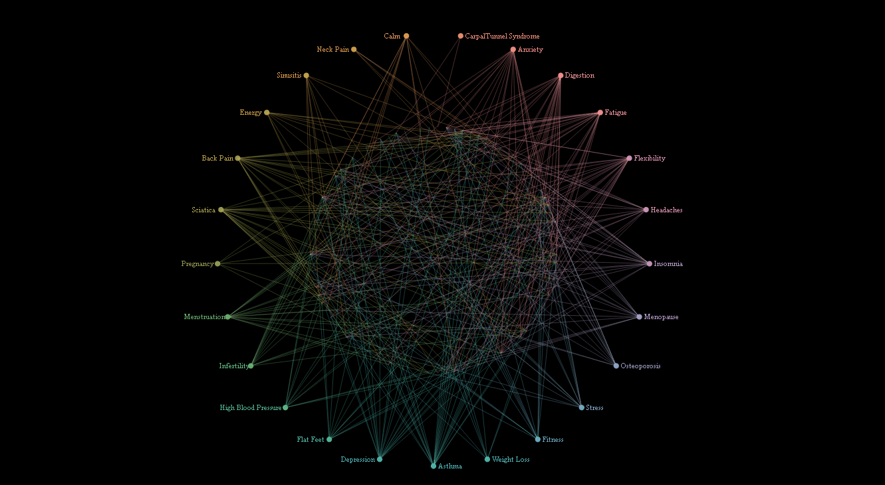

# DatAsana  

Status : WIP - on hold for now :)

## Flow  
### Collecting data  
1- Get data from a website (see Sources)  
2- Study the structure of HTML doc  
3- Create CSV file with BeautifulSoup4  

### Chart  
1. Initialize first wheel with benefits  
2. Initialize second wheel with pose names  
3. Add the lines between the points w/ colors  

Data structure is defined by the following rules :  
* Sanskrit name is first & unique  
* English name is first & unique  
* Types of pose are contained in double quotes  
* Benefits are contained in square bracket (list of strings)  

## TODO  
1. Clean up Python code  
2. Add JS function to display name in English or Sanskrit  
3. Add JS function to display poses by type or benefits  
4. Delete all for loops and replace with .data() .enter() because it is neat  
5. Fix how the text is displaying for poses (following path is the best option?)

## Requirements   
### Python script to parse data  
- Python 3.6
- BeautifulSoup 4.4.6  

## Sources
[Yoga poses and info](https://www.yogajournal.com)  
[Chord Diagram based](http://bl.ocks.org/farazshuja/6225ffc34c23ade0de169c4d96252bbe)  
[Text on Arc](http://bl.ocks.org/nbremer/bf6d15082ea81ce69b55)

## Other  
Feel free to use the yoga dataset I created :)  

Python code to extract dataset can be optimized, I did not think of any algo that can accelerate the extraction of the data since I only needed to do it once but any suggestions are welcomed anyway :D  
